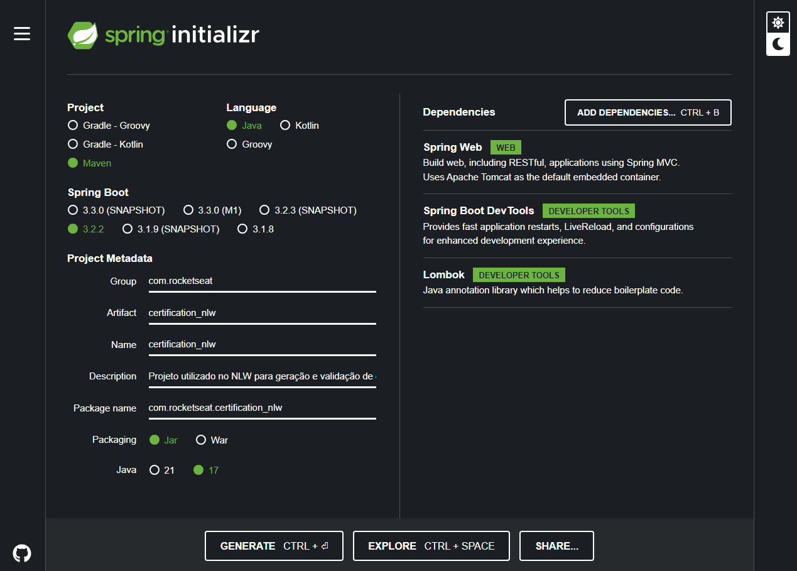
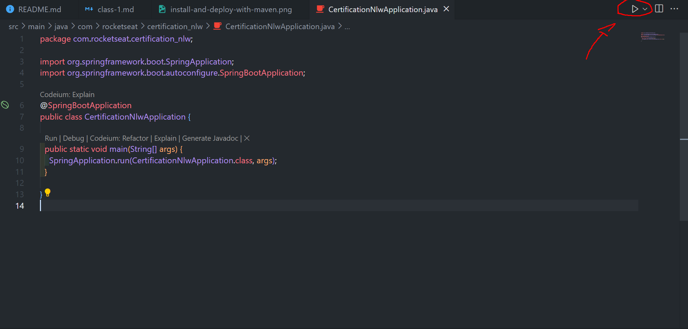
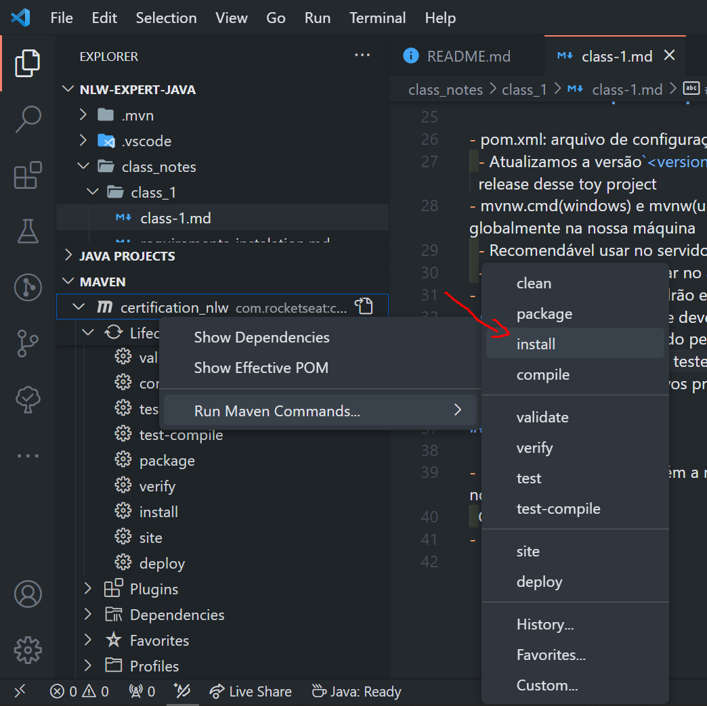
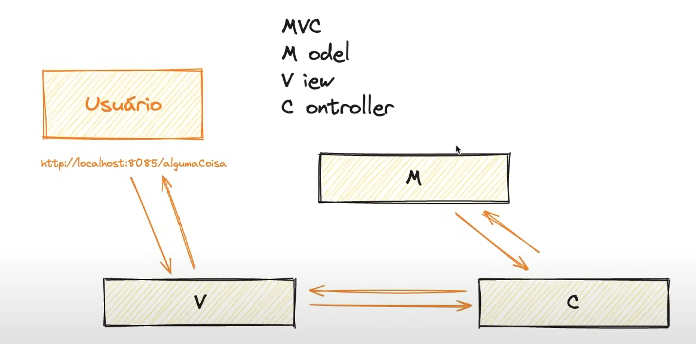
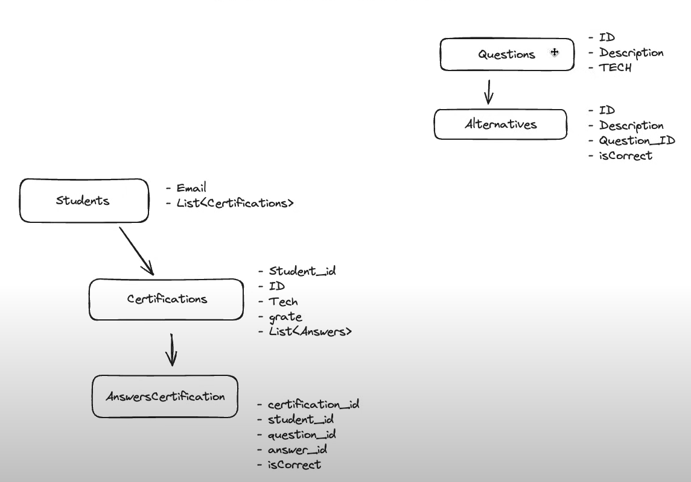

# Anotações da aula 1

- [instalando requisitos](requirements-instalation.md)
- Inicializando projeto com: [spring initializr](https://start.spring.io/) projeto mantido pelos desenvolvedores do spring
  - Configurações utilizadas:
  - 
    - Maven como gerenciador de pacotes
    - Java como linguagem
    - Versão 3.2.2 lts do spring boot
    - Metadados do projeto:
      - Grupo: Geralmente se coloca o domínio da empresa de trás pra frente; EX: site da empresa: rocketseat.com.br, Group: br.com.rocketseat
      - Artifact: Nome do projeto/palavras chaves
      - Name: Mesma coisa do artifact, ao menos que se queira mudar
      - Descrição: a descrição do projeto
      - Package name: Nome final do pacote java que vai ser gerado; EX: no projeto atual temos: com.rocketseat.certification_nlw mas poderiamos omitir o nome sobrando apenas: com.rocketseat o que pode gerar problemas se tivermos vários códigos da mesma organização, geralmente é bom manter o nome completo do pacote
      - Packaging: O tipo de empacotamento; o Jar é um empacotamento padrão que não precisa por padrão de um servidor web para rodar a aplicação, pode ser rodado pela comand line, já o War precisa obrigatoriamente de um servidor para o rodar
        - Antes do spring boot o War sempre era usado para aplicações web, hoje em dia com spring boot da pra se rodar o Jar tanto no serividor quanto pela linha de comando, pois o spring boot cria o jar com um serivdor embedded(java tomcat)
      - Dependencias spring utilizadas:
        - Spring web: Para construir apis restful, mvc e web
        - Spring boot devtools: Para monitorar as alterações no projeto dar live reload
        - Lombok: gera getters e setters automaticamente reduzindo boilerplate
    - Baixar o .zip e descompactar seu conteúdo na pasta do projeto

## Entendendo arquivos do projeto:

- pom.xml: arquivo de configuração do projeto e versões do pacotes
  - Atualizamos a versão`<version>0.0.1-SNAPSHOT</version>` para `<version>1.0.0</version>` pois vamos trabalhar já com um release desse toy project
- mvnw.cmd(windows) e mvnw(unix): Arquivos do mavem que servem para permitir rodar a aplicação sem ter o maven instalado globalmente na nossa máquina
  - Recomendável usar no servidor
  - Não recomendável utilizar no ambiente de desenvolvimento a menos que tenhamos pouca memória e recursos disponíveis
- Help: Documentações padrão e guias
- Gitgnore: documentos que devem ser ignorados pelo git
- Pasta target: arquivo gerado pelo maven após rodar a aplicação como jar e objetos compilados
- pasta src/test: arquivos de teste
- src/main/java/...: arquivos principais do código da aplicação, onde fica o main
- src/resources/application.properties: arquivo de configurações extra do projeto

## Rodando o projeto:

- indo no arquivo que contém a main, no caso: CertificationNlwApplication.java e clicando no icone superior direito de rodar no VSCode recomendado para debug
  OU
- na aba maven 
  OU
- Pelo terminal: `mvn spring-boot:run` recomendado para run padrão

## Seguindo o fluxo da aula:

- mudando porta do pojeto de 8080 para 8085 adicionando: server.port=8085 ao application.properties
  - acessando localhost:8085 temos:

### MVC(Model View Controller)

- 
  - Usuário acessa a view pela rota "/alguma-rota"
  - A view chamaria a controller que teria toda a lógica de negócios
  - A controller chamaria o model para recuperar os dados
  - Retornando assim o fluxo de dados para a view

### Spring Boot

- A aplicação usa controllers para retornar páginas e rest controllers para retornar json e comunicar entre apis
- A class controller tem que ter o mesmo nome do arquivo que contém ela
- O spring boot simplifica as dependências e para isso sempre usa o package espelhando a rota das pastas; EX: `com.rocketseat.certification_nlw` é um espelho de `/com/rocketseat/certification_nlw`. O espelhamento serve para facilitar o escaneamento do spring nos arquivos e gerenciar as dependências do projeto.
- Adicionar `@RestController` acima de uma classe já define que a mesma retornará json e funcionará como uma api rest
- Adicionar o anotator na classe controller `@RequestMapping("/rota")` no controller para definir a rota para acessar essa controller
- Adicionar o anotator `@GetMapping("/subRota")` em um metodo dentro da controller adiciona uma rota ao path definido na anotator `@RequestMapping("/rota")` gerando no final: `/rota/subRota` e define que a mesma funcionara como um método GET
- a partir da versão 10 do java não é necessário tipar variáveis na instaciação de uma classe, pois o tipo pode ser inferido, podendo assim ser usaro a palavra reservada `var`
- Para retornar um objeto como json basta o adicionar como retorno de um método de uma classe com o anotator `@RestController`
- Para fazer um post basta adicionar o anotator `@PostMapping("/meuPrimeiroPost")`

### methods/verbs rest

- GET: Buscar informações
- POST: Inserir informações
- PUT: Alterar dados
- DELETE: Deletar dados
- PATCH: Alterar parcialmente dados

#### Tipos de parâmetros:

- Body: corpo da requisição; `Body:{}`, geralmente para: Post, Put, Patch
- Query: consulta da requisição; `http://localhost:8085/rota?parametro=valor` OPCIONAIS
- Parametros de rota: cabecalhos da requisição `http://localhost:8085/rota/{parametro}/{parametro2}` OBRIGATÓRIO
- Headers: cabecalhos da requisição
- Cookies: cookies da requisição
- Path: rota da requisição;

- Post não pode ser requisitado pela rota de navegação do navegador pois a mesma por padrão é um get e para testar um post é necessário um Rest Client como httpie

## Overview do conteúdo da aplicação:

-

## Utilizando Loombok:

- Adicionando os anotators `@Getter` e `@Setter` para gerar os getters ou setters automaticamente ou `@Data` para gerar ambos, sendo eles no parametro ou na classe;
- Adicionando os anotators `@AllArgsConstructor` e `@NoArgsConstructor` para gerar os construtores automaticamente, sendo eles com todas as propriedades da classe ou com nenhuma;

## Utilizando DTO's

- Para receber informações do body da requisição na controller em casos onde nenhum dos objetos contém todos os dados da requisição, então criamos um DTO contendo a informação que a gente quer apenas para definirmos para o java o que receberemos da requisição;

## Use cases e camada de serviço

- adicionar o anotator `@Service` a classe que contém a camada de serviço
- Ao importar e chamar a classe `@Service` o spring vai gerar automaticamente um construtor e um mecanismo de injecão de dependência, precisando apenas setar uma variável e um import como em:

```Java
public class StudentController {
  // Chamar o usecase
  @Autowired
  private VerifyIfHasCertificationUseCase verifyIfHasCertificationUseCase;

  @PostMapping("/verifyIfHasCertification")
  public String verifyIfHasCerfitication(@RequestBody VerifyHasCertificationDTO verifyHasCertificationDTO) {
    // Email
    // Technology
    var result = this.verifyIfHasCertificationUseCase.execute(verifyHasCertificationDTO);
    if (result) {
      return "Usuário já fez a prova";
    }
    System.out.println(verifyHasCertificationDTO);// verifyIfHasCerfitication(verifyHasCertificationDTO)
    return "Usuário pode fazer a prova";
  }
}
```
