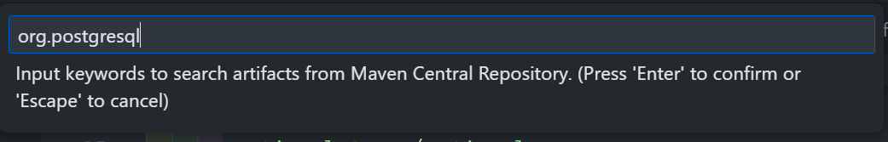

# Anotações Aula 2

- Dependencia de integração com banco de dados:

  - [Spring data jpa(java persistence apis)](https://spring.io/projects/spring-data-jpa)
    - Utiliza o Hibernate por debaixo dos panos
      - Hibernate é um ORM(Object Relation Mapper) pois ele mapeia objetos em tabelas de um banco de dados relacional
  - Instalando as dependências do "spring data jpa" e do postgres

    - Abrindo o arquivo `pom.xml` podemos adicionar de 2 formas:
      - Copiando do site o xml para o arquivo pom EX:

    ```xml
    <!-- https://mvnrepository.com/artifact/org.postgresql/postgresql -->
    <dependency>
    <groupId>org.postgresql</groupId>
    <artifactId>postgresql</artifactId>
    <version>42.7.1</version>
    </dependency>
    ```

    - ou com control + shift + p
      - 
      - 
      - 

## Criando docker compose para postgres:

- [imagem oficial e documentação do postgresql](https://hub.docker.com/_/postgres)
- [Tutorial de como configurar um docker compose para postgres](https://commandprompt.com/education/how-to-install-postgresql-using-docker-compose/)
- Conectar no pqsl em um container docker:

```bash
docker ps
CONTAINER ID        IMAGE               COMMAND                  CREATED             STATUS              PORTS                     NAMES
05b3a3471f6f        postgres            "/docker-entrypoint.s"   1 seconds ago       Up 1 seconds        0.0.0.0:5432->5432/tcp    some-postgres
```

```bash
docker exec -it <containerID> bash
root@05b3a3471f6f:/# psql -U postgres
postgres-# CREATE DATABASE mytest;
postgres-# \q
```

fonte: [Connecting to Postgresql in a docker container from outside](https://stackoverflow.com/questions/37694987/connecting-to-postgresql-in-a-docker-container-from-outside)

- Tutorial de uso do postgres:
  - [PostgreSQL Tutorial](https://www.postgresqltutorial.com/)
  - [Top psql commands and flags you need to know | PostgreSQL](https://hasura.io/blog/top-psql-commands-and-flags-you-need-to-know-postgresql/)

### Relacionamentos entre tabelas:

- adicionando os anotators @ManyToOne, @OneToMany, @manyToMany e @OneToOne em um parametro de uma classe e em outro de outra classe que está se relacionando com a mesma e adicionando o @mappedby para o relacionamento
- Após a criação do relacionamento, o Hibernate irá criar uma tabela na base de dados com a nova coluna que foi criada
- É recomendado remover tabelas que foram geradas no processo de execução do programa quando utilizado o: `spring.jpa.hibernate.ddl-auto=update` dentro do arquivo `application.properties`

## Camada repositorio(repository):

- ORM (Object Relational Mapping) - Mapeamento de objetos em tabelas
- Camada repository - Interagir com o banco de dados
- Para o spring indentificar que a interface criada é um repository basta usar o anotator:`@Repository`
